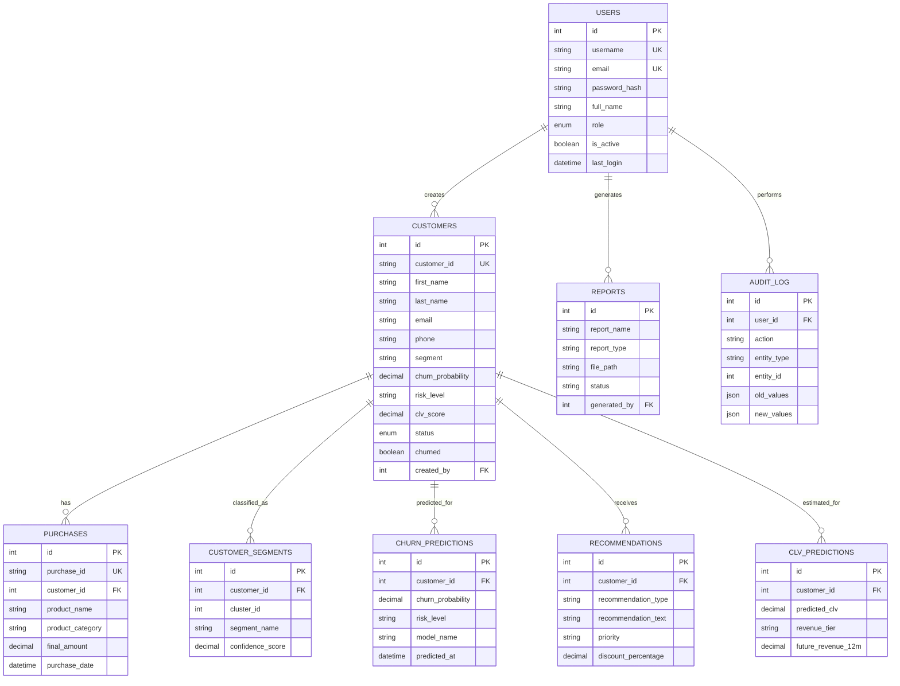

# Entity-Relationship Diagram

## ER Diagram (Text Representation)

```
┌─────────────────────┐       ┌──────────────────────────┐
│       USERS         │       │        CUSTOMERS          │
├─────────────────────┤       ├──────────────────────────┤
│ PK id              │◄──┐   │ PK id                    │
│    username         │   │   │    customer_id (UQ)      │
│    email (UQ)       │   ├───│ FK created_by            │
│    password_hash    │   │   │    first_name            │
│    full_name        │   │   │    last_name             │
│    role             │   │   │    email                 │
│    is_active        │   │   │    phone                 │
│    last_login       │   │   │    ...                   │
│    created_at       │   │   │    segment               │
│    updated_at       │   │   │    churn_probability     │
└─────────────────────┘   │   │    risk_level            │
                          │   │    clv_score             │
                          │   │    status                │
                          │   │    churned               │
                          │   │    acquired_date         │
                          │   │    created_at            │
                          │   └──────────┬───────────────┘
                          │              │
              ┌───────────┼──────────────┼───────────────┬──────────────┐
              │           │              │               │              │
              ▼           ▼              ▼               ▼              ▼
┌──────────────────┐ ┌───────────┐ ┌───────────┐ ┌────────────┐ ┌──────────────┐
│   PURCHASES      │ │ SEGMENTS  │ │ CHURN     │ │ RECOMMEND- │ │ CLV          │
├──────────────────┤ ├───────────┤ │ PREDICT.  │ │ ATIONS     │ │ PREDICTIONS  │
│ PK id            │ │ PK id     │ ├───────────┤ ├────────────┤ ├──────────────┤
│    purchase_id   │ │ FK cust_id│ │ PK id     │ │ PK id      │ │ PK id        │
│ FK customer_id ──┤─┤─          │ │FK cust_id─┤─│ FK cust_id─┤─│ FK cust_id──┤─
│    product_name  │ │ cluster_id│ │ churn_prob│ │ rec_type   │ │ predicted_clv│
│    total_amount  │ │ seg_name  │ │ risk_level│ │ rec_text   │ │ revenue_tier │
│    final_amount  │ │ confidence│ │ model_name│ │ priority   │ │ future_rev   │
│    purchase_date │ │ predicted │ │ predicted │ │ discount % │ │ model_name   │
└──────────────────┘ └───────────┘ └───────────┘ └────────────┘ └──────────────┘

┌──────────────────┐  ┌──────────────────┐
│     REPORTS      │  │    AUDIT_LOG     │
├──────────────────┤  ├──────────────────┤
│ PK id            │  │ PK id            │
│ FK generated_by ─┤──│ FK user_id       │
│    report_name   │  │    action        │
│    report_type   │  │    entity_type   │
│    file_path     │  │    entity_id     │
│    status        │  │    old_values    │
└──────────────────┘  │    new_values    │
                      └──────────────────┘
```

## Relationships

| Relationship | Type | Description |
|-------------|------|-------------|
| Users → Customers | One-to-Many | A user can create multiple customers |
| Users → Reports | One-to-Many | A user can generate multiple reports |
| Customers → Purchases | One-to-Many | A customer has multiple purchases |
| Customers → Segments | One-to-Many | A customer has segmentation results |
| Customers → Churn Predictions | One-to-Many | A customer has multiple prediction records |
| Customers → Recommendations | One-to-Many | A customer has multiple recommendations |
| Customers → CLV Predictions | One-to-Many | A customer has multiple CLV predictions |

## Mermaid ER Diagram


